# Notebook Automation

A comprehensive toolkit that transforms educational content into intelligent, searchable knowledge bases. It processes PDFs, extracts annotations, generates AI-powered summaries from videos (with transcripts) and questions/answers, creates hierarchical course structures, and seamlessly integrates with popular tools like Obsidian and Anki for enhanced learning workflows.

## 💡 The Story Behind this Project

Like many students and lifelong learners, I found myself manually collecting course content from various online platforms—downloading PDFs, saving lecture notes, organizing video files, and trying to keep track of assignments across multiple courses. This tedious process consumed hours that could have been spent actually learning.

After spending countless evenings manually organizing course materials, I discovered the brilliant [coursera-dl](https://github.com/coursera-dl/coursera-dl) and [Coursera-Downloader](https://github.com/touhid314/Coursera-Downloader) projects. These tools opened my eyes to the power of automation for educational content management. The coursera-dl project, with its ability to batch download lecture resources and organize them with meaningful names, and the Coursera-Downloader's intuitive GUI for downloading entire courses, showed me what was possible when automation meets education.

Inspired by these projects but needing broader functionality beyond just downloading, I set out to create a comprehensive toolkit that could not only organize content but also analyze, tag, and enhance it with AI-powered insights. The result is Notebook Automation—a project born from the frustration of manual organization and the inspiration of seeing what thoughtful automation could achieve in the educational space.

[](https://github.com/danielshue/notebook-automation/actions)
[](https://github.com/danielshue/notebook-automation/releases/latest)
[](https://deepwiki.com/danielshue/notebook-automation)
[](https://opensource.org/licenses/MIT)
[](https://dotnet.microsoft.com/download/dotnet/10.0)

## ✨ Key Features

- **🤖 AI Chat Mode** - Interactive AI assistant with 21 integrated tools for vault management, content processing, and intelligent workflows
- **📊 Intelligent Processing** - AI-powered content analysis and summarization
- **🗂️ Obsidian Integration** - Comprehensive vault integration featuring hierarchical course structures, rich YAML frontmatter, contextual menu automation, bidirectional OneDrive synchronization, automated index generation, cross-referenced note linking, and seamless plugin-based workflow management for enhanced knowledge discovery
- **📈 Progress Tracking** - Real-time processing status and logging of course content
- **❓ Question Generation** - AI-powered Q&A creation for study materials
- **📚 Anki Integration** - Export flashcards for spaced repetition learning
- **🎥 Video Transcript Processing** - Generate summaries from video content
- **🎬 Transcript Consolidation** - Merge lesson transcripts into class-level notes with automatic links and metadata
- **📄 PDF Annotation Extraction** - Preserve highlights and comments from documents
- **📝 Vocabulary Management** - Extract and organize key terms and definitions
- **📁 Batch Operations** - Process multiple content for note efficiently
- **☁️ OneDrive Folder Synchronization** - Create and maintain folder structures in OneDrive without content transfer for organizational alignment
- **🔗 OneDrive Shared Links Management** - Generate and manage shareable links for collaborative access to course materials and resources
- **🔧 Extensible Architecture** - Plugin system for custom processors

## 🤖 AI Chat Mode

Notebook Automation now includes an interactive AI-powered chat mode that brings intelligent assistance directly to your command line. The AI assistant has access to 21 specialized tools for vault management, content processing, and workflow automation.

### ✨ Features

- **💬 Interactive Chat** - Natural language conversation with streaming responses
- **🛠️ Tool Integration** - AI can execute 21 CLI tools to help manage your vault
- **📝 Session Management** - Save and resume conversations with full history
- **⚡ Streaming Responses** - Real-time AI responses as they're generated
- **🔄 Context Awareness** - AI understands your vault structure and configuration
- **🎯 One-Shot Queries** - Quick questions without entering chat mode

### 🚀 Quick Start

#### Setup

1. **Set your API key** (choose one provider):

```bash
# Azure OpenAI
export AZURE_OPENAI_KEY="your-azure-openai-key"

# OpenAI
export OPENAI_API_KEY="your-openai-key"
```

2. **Configure provider** in `config/config.json`:

```json
{
  "aiservice": {
    "provider": "azure", // or "openai"
    "azure": {
      "endpoint": "https://your-resource.cognitiveservices.azure.com/",
      "deployment": "gpt-4",
      "model": "gpt-4"
    }
  },
  "copilot": {
    "enabled": true,
    "autoChatMode": true,
    "enableStreaming": true
  }
}
```

#### Usage

**Auto-Enter Chat Mode** (if `autoChatMode: true`):

```bash
na
```

**Explicit Chat Mode**:

```bash
na copilot
na copilot --model gpt-4o
na copilot --resume                  # Resume last session
na copilot --session <session-id>    # Resume specific session
```

**Copilot Setup & Status**:

```bash
na copilot status        # Check GitHub Copilot availability
na copilot install-guide # Show installation instructions
na copilot install       # Attempt automatic installation (Windows only)
```

**One-Shot Questions**:

```bash
na ask "How do I generate index files for my vault?"
na ask "What video files do I have?" --json
```

**Built-in Chat Commands**:

- `help` - Show available commands
- `exit` or `quit` - Exit chat mode
- `clear` - Clear screen
- `history` - Show conversation history
- `session` - Manage chat sessions

### 🛠️ Available AI Tools (21 Total)

The AI assistant has access to 21 specialized tools across multiple categories:

#### Vault Management

- `vault_generate_index` - Create index files for vault directories
- `vault_clean_index` - Remove existing index files
- `vault_ensure_metadata` - Synchronize metadata across markdown files
- `vault_sync` - Sync vault with OneDrive (up/down)

#### Tag Management

- `tag_add_nested` - Add nested tags to markdown files
- `tag_consolidate` - Merge duplicate tags
- `tag_restructure` - Restructure tag hierarchy
- `tag_update_frontmatter` - Update YAML frontmatter
- `tag_diagnose_yaml` - Detect YAML issues
- `tag_metadata_check` - Validate metadata consistency
- `tag_clean_index` - Remove tag data from indexes

#### File Conversion & Processing

- `pdf_convert` - Convert PDF content to markdown
- `video_create_notes` - Generate notes from video transcripts
- `video_consolidate_transcripts` - Merge transcripts into class notes
- `markdown_generate` - Convert HTML/EPUB to markdown

#### Configuration & Authentication

- `config_view` - Display current configuration
- `config_update` - Modify settings
- `config_validate` - Verify configuration
- `config_list_keys` - List available config keys
- `config_secrets_status` - Check authentication status
- `onedrive_refresh_token` - Refresh OneDrive authentication

### 💡 Example Conversations

```bash
You: Show me my vault structure
AI: [Uses vault_generate_index to analyze structure]
    I can see you have 3 main directories...

You: Generate indexes for all directories
AI: [Calls vault_generate_index]
    ✓ Created index for /Projects
    ✓ Created index for /Courses
    ✓ Created index for /Resources

You: What video files need transcripts?
AI: [Scans vault using video tools]
    Found 5 videos without transcripts:
    - lecture-01.mp4
    - lecture-02.mp4
    ...
```

### 📊 Technical Details

- **AI Provider**: Azure OpenAI or OpenAI via Microsoft.Extensions.AI
- **Architecture**: Semantic Kernel with function calling
- **Streaming**: Real-time token streaming for responsive interaction
- **Session Persistence**: Automatic session saving and restoration
- **Tool Execution**: Automatic tool invocation based on conversation context

For complete technical documentation, see [SDK Integration Status](docs/SDK-INTEGRATION-STATUS.md).

## 🏗️ Core Architecture: Location-Agnostic Design

One of the fundamental architectural principles of Notebook Automation is **location-agnostic processing**, designed to seamlessly work across different computers, operating systems, and folder structures while maintaining consistency and portability.

### 🌐 Cross-Platform Compatibility

The system uses **relative paths** and **configuration-based resolution** to ensure your knowledge base works identically across different environments:

**Document Placeholder Approach:**

```yaml
# Frontmatter in Document Placeholder
title: "Operations Management Video"
template-type: video-reference
onedrive_relative_path: "Value Chain Management/Operations Management/course1/video1.mp4"
```

**Environment-Specific Configuration:**

```json
{
  "onedrive_fullpath_root": "C:\\Users\\Alice\\OneDrive\\",
  "onedrive_resources_basepath": "Education\\MBA-Resources",
  "notebook_vault_fullpath_root": "D:\\MyVault\\",
  "notebook_vault_resources_basepath": "01_Projects\\MBA"
}
```

### 🔄 Smart Path Resolution

The system intelligently resolves paths through multiple strategies:

1. **Document Placeholders** store relative paths in frontmatter
2. **Local configuration** provides environment-specific roots
3. **Path resolution engine** combines relative + absolute paths
4. **Multi-location search** finds files across vault structures
5. **Graceful fallbacks** handle missing files or configurations

### ✅ Benefits of This Architecture

- **🤝 Team Collaboration**: Share Document Placeholders via Git without path conflicts
- **💻 Device Independence**: Same vault works on laptop, desktop, any OS
- **🔄 Backup/Restore**: Move vault to new computer, just update configuration
- **🗂️ Flexible Organization**: Each team member can organize OneDrive differently
- **🌍 Platform Agnostic**: Works seamlessly on Windows, macOS, and Linux

### 🔧 Implementation Details

The **Document Placeholder** acts as a contract between content and environment:

- **Content Layer**: Relative paths, template types, metadata (portable)
- **Configuration Layer**: Absolute paths, local preferences (environment-specific)
- **Resolution Engine**: Intelligent path combining and file discovery

### 📝 File Naming Conventions

**Document Placeholders** follow a consistent naming pattern that indicates their content type:

- **Video files**: `filename-video.md` (e.g., `03_01_defining-operations-management-video.md`)
- **PDF files**: `filename-pdf.md` (e.g., `case-study-analysis-pdf.md`)
- **Reading materials**: `filename-html.md` (e.g., `course-instructions-html.md`)

This naming convention ensures:

- **🔍 Easy Identification**: File type is immediately apparent
- **🔧 Processing Compatibility**: System correctly routes files to appropriate processors
- **📂 Consistent Organization**: Placeholders and processed files follow same naming pattern
- **🚀 Seamless Workflow**: No naming conflicts during automated processing

When you create Document Placeholders (either manually or via vault sync), they automatically use the correct suffix based on the referenced content type. The processing system then generates final notes with matching names, ensuring a smooth end-to-end workflow.

This creates a **portable, shareable knowledge management system** that adapts to each user's setup while maintaining consistency in content and workflow.

## 📸 Screenshots & Features

### AI-Generated Page Summaries

Each processed document receives an intelligent summary that captures key points, main themes, and actionable insights. These summaries help you quickly review and recall important content.
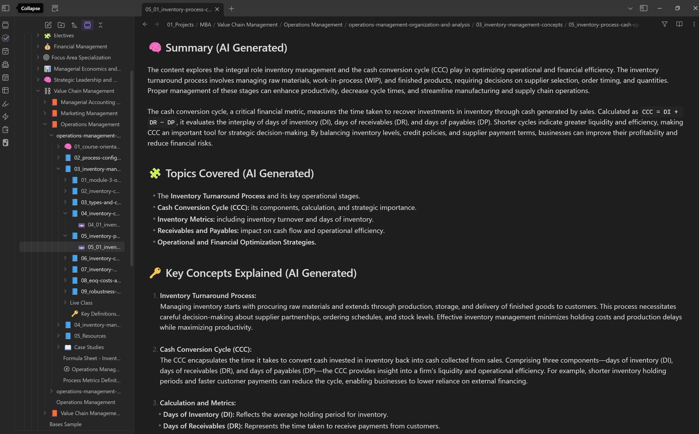

### AI-Powered Question Generation

The system automatically generates intelligent questions and answers from your course content, perfect for creating study materials and spaced repetition systems. This feature leverages AI to identify key concepts and create meaningful assessment questions.

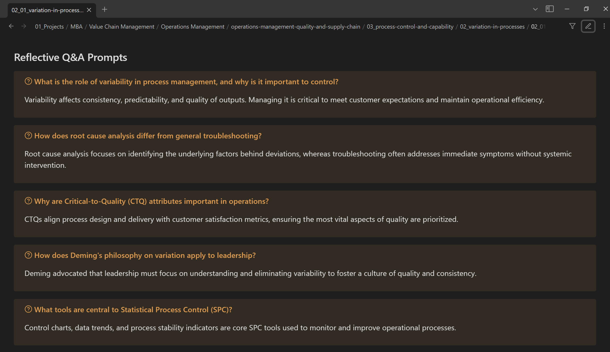

### Anki Integration for Spaced Repetition

These Questions and Answers can be used to seamlessly export the generated questions to Anki for optimized learning through spaced repetition. The tool creates properly formatted flashcards that integrate with your existing study workflow.

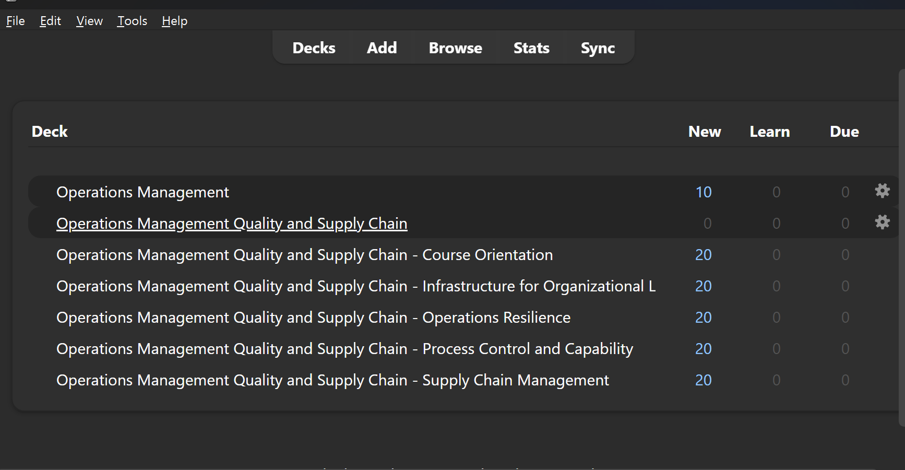

### Obsidian Content Indexes and Class View

#### Navigation Through Indexes

Demonstrate here is the hierarchical navigation system within Obsidian. Using the Bases template system, users can easily explore their course content through structured indexes. These indexes provide a clear overview of programs, courses, modules, and lessons, enabling seamless navigation and quick access to specific sections of the educational material.

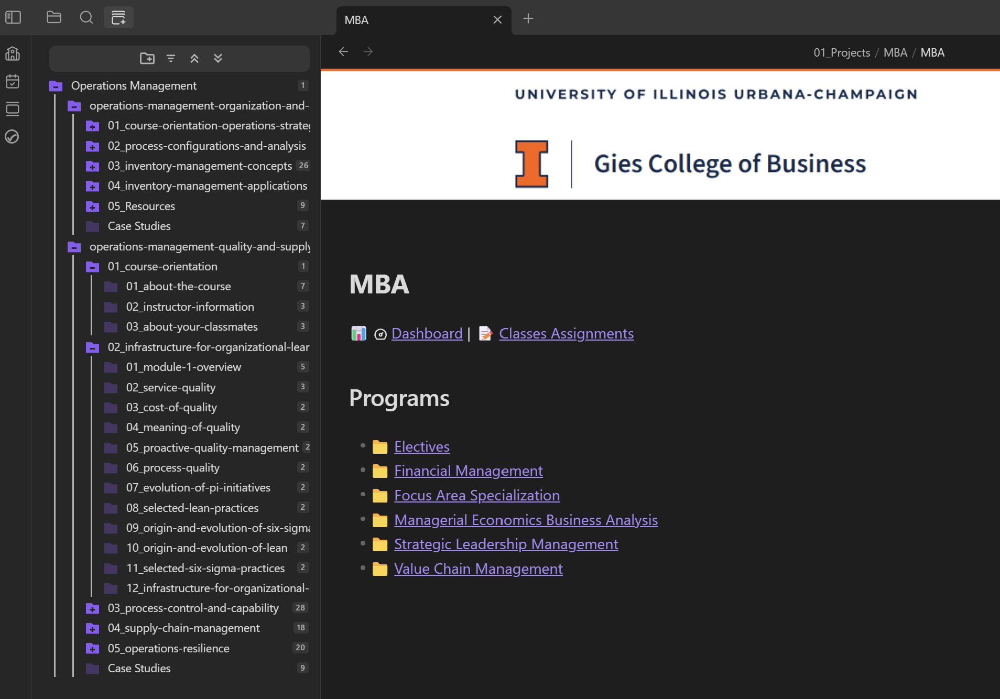

#### Class-Level Page Tracking

Highlighting the class-level page view, which tracks individual notes and document statuses. This view allows users to monitor the progress of their course materials, ensuring that all notes and documents are properly organized and up-to-date. It provides a centralized location to manage and review class-specific content efficiently.

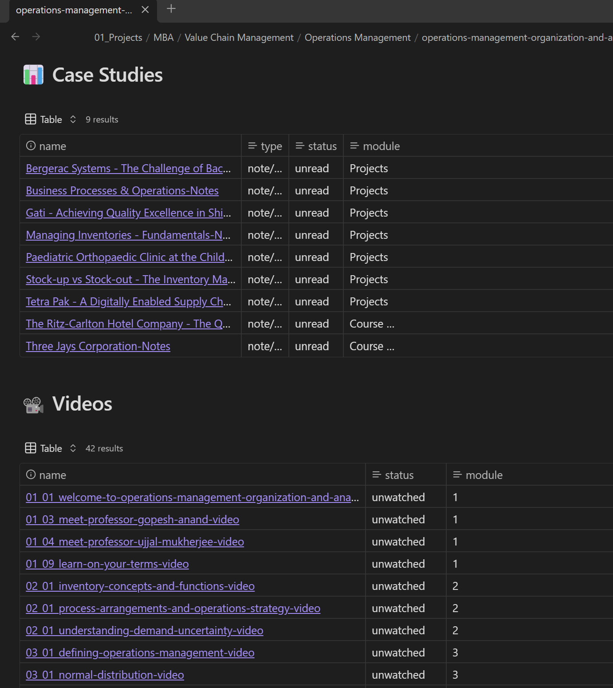

### Case Study Analysis Views

Detailed case study notes with structured analysis, key insights, and cross-references. The system automatically formats complex business cases into digestible, searchable content.

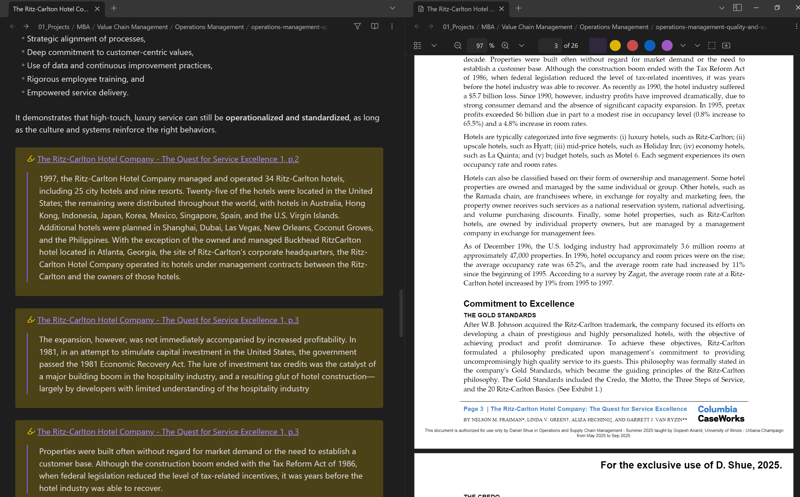

### PDF Annotation Processing

Automatically extract and process annotations from PDF documents, preserving highlights, comments, and notes in your knowledge base while maintaining proper attribution and context.

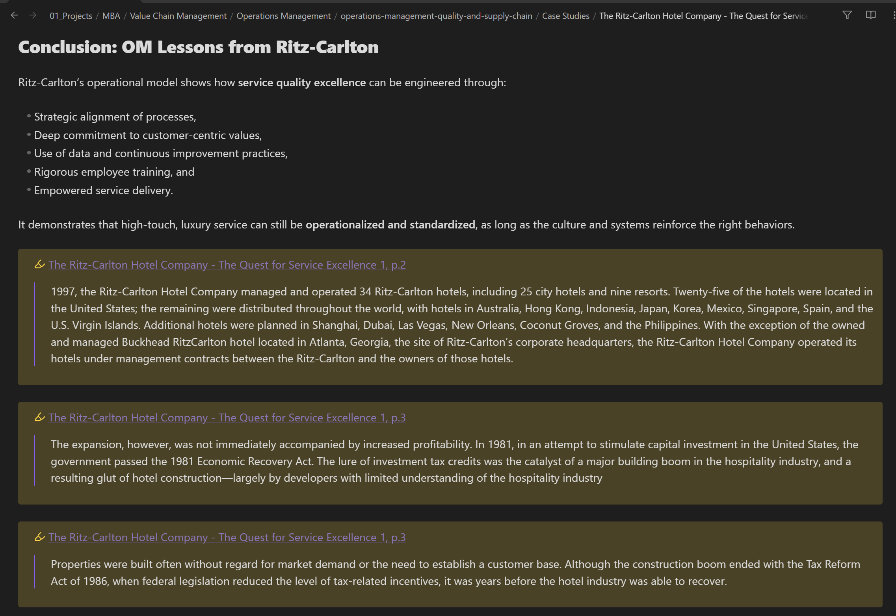

### Rich YAML Frontmatter

Comprehensive metadata extraction creates rich YAML frontmatter with course information, tags, relationships, and custom properties that enhance searchability and organization.

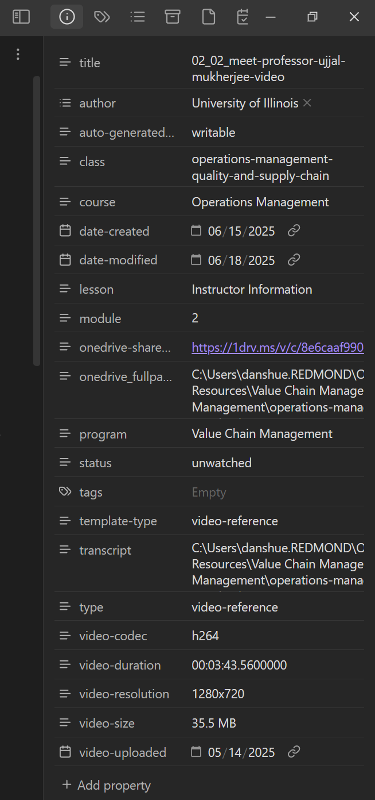

### Vocabulary and Definition Management

Automatically identify and extract key terms and definitions from course materials, creating a searchable vocabulary database with contextual usage examples that can also imported into Anki.

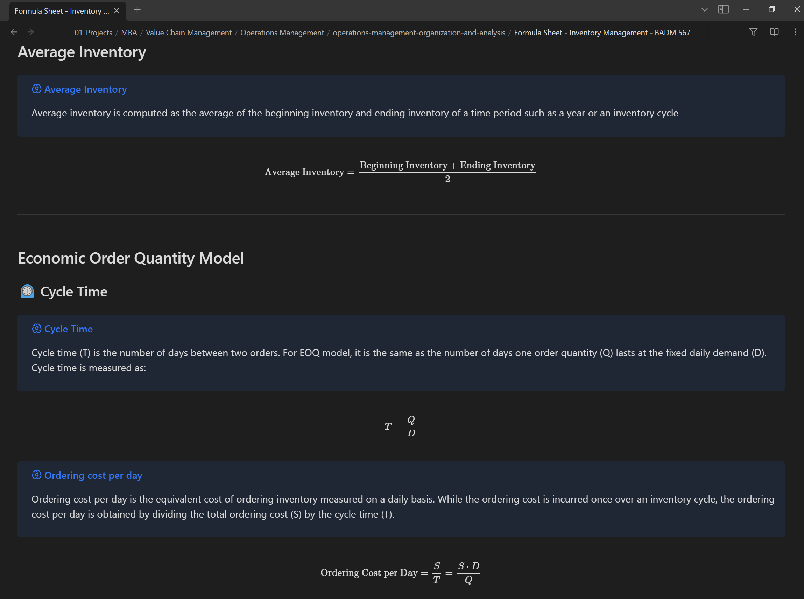

### Obsidian Plugin Integration

#### Comprehensive Settings & Configuration

The Obsidian plugin provides a comprehensive settings interface that allows you to customize every aspect of the automation workflow. From enabling specific AI processing features to configuring file paths and behavior options, the settings panel gives you granular control over how the toolkit integrates with your vault and processes your educational content.The Notebook Automation toolkit has been designed for both command-line interface (CLI) and Obsidian plugin usage, providing users with flexible deployment options to match their preferred workflow. Whether you prefer the precision and automation capabilities of CLI commands or the seamless integration within your Obsidian vault, the system offers extensive and flexible configuration options that adapt to your specific needs and preferences.

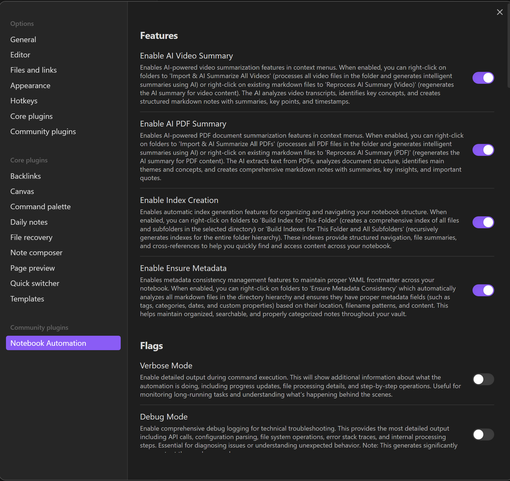

#### Contextual Menu Integration

The plugin seamlessly integrates with Obsidian's native interface through context menus, providing instant access to powerful automation features directly from your file explorer. Right-click on any folder or file to access processing options like AI summarization, index generation, and OneDrive synchronization—bringing professional-grade automation tools directly into your daily workflow.

- **Create Consolidated Video Transcript(s)** gathers every existing transcript in the selected folder, generates section headings with friendly titles, and produces a single class-level note. When the new **Recursive Transcript Consolidation** toggle is enabled in plugin settings, the command also scans nested lessons (shown in the menu as “(Recursive)”). The CLI enforces your configured `notebook_vault_resources_basepath`, so even though the menu is available everywhere, consolidation only executes inside the approved vault scope.

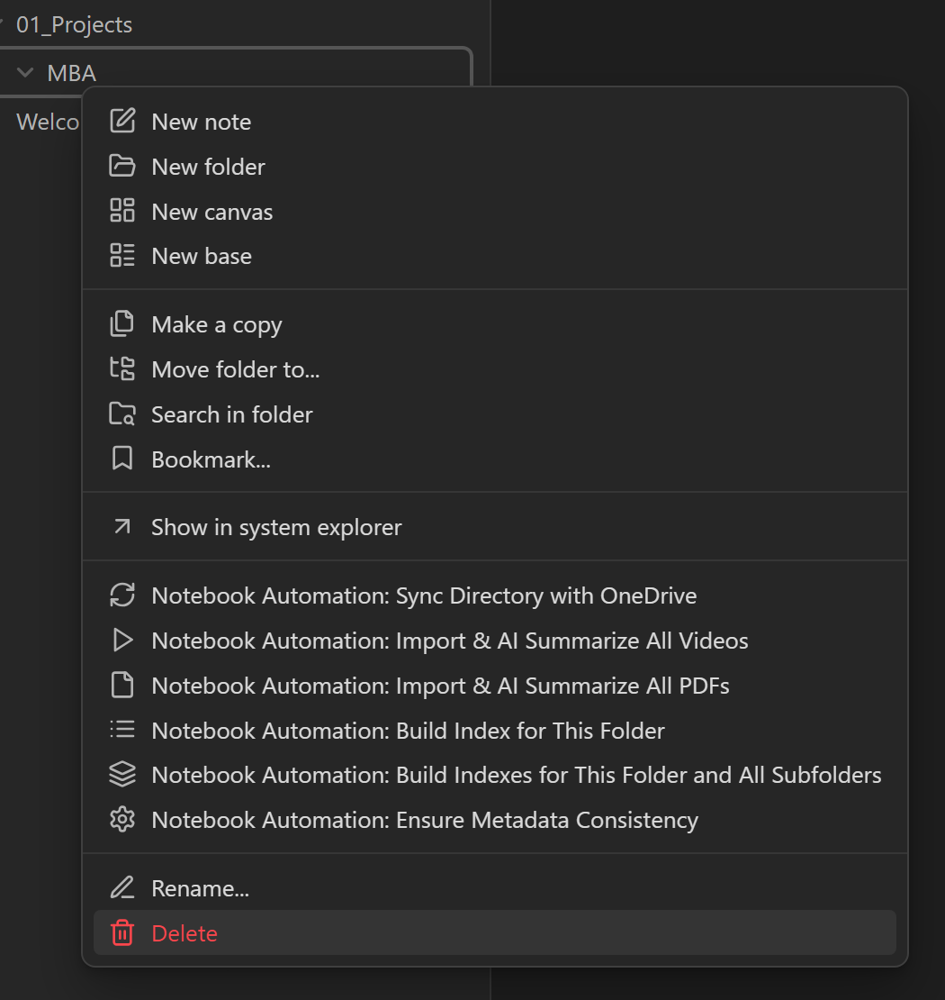

#### OneDrive & Vault Synchronization

The toolkit includes sophisticated synchronization capabilities that bridge your Obsidian vault with OneDrive storage, ensuring your educational content remains accessible across all devices and platforms. The system supports both bidirectional synchronization (default) for seamless two-way updates, and unidirectional synchronization for controlled content flow. This flexible approach allows you to maintain local vault organization while leveraging cloud storage benefits, automatically handling file mapping, conflict resolution, and maintaining metadata consistency between your vault structure and OneDrive folders.

## 📖 Documentation

| Section                                                      | Description                                                   |
| ------------------------------------------------------------ | ------------------------------------------------------------- |
| [**Getting Started**](docs/getting-started/index.md)         | Installation, setup, and first steps                          |
| [**User Guide**](docs/user-guide/index.md)                   | Comprehensive usage documentation                             |
| [**Configuration**](docs/configuration/index.md)             | Settings and customization options                            |
| [**Migration Guide**](docs/migration-guide.md)               | **NEW**: Upgrade from legacy metadata.yaml to new schema      |
| [**Metadata Schema**](docs/metadata-schema-configuration.md) | **NEW**: Complete metadata-schema.yml configuration reference |
| [**Plugin Development**](docs/plugin-development.md)         | **NEW**: Extensible resolver development and registry usage   |
| [**Tutorials**](docs/tutorials/index.md)                     | Step-by-step examples and workflows                           |
| [**API Reference**](docs/api/index.md)                       | Detailed API documentation                                    |
| [**Developer Guide**](docs/developer-guide/index.md)         | Building and contributing                                     |
| [**Troubleshooting**](docs/troubleshooting/index.md)         | Common issues and solutions                                   |

## 🛠️ System Requirements

- **.NET 9.0 SDK** or later
- **Windows 10/11**, **Linux**, or **macOS**
- **PowerShell** (for build scripts)
- **8GB RAM** recommended for large notebook processing

## 🏗️ Project Structure

```
notebook-automation/
├── .github/                     🏗️ CI/CD workflows and templates
├── .vscode/                     🔧 VS Code configuration and tasks
├── src/                         📁 Source code
│   ├── c-sharp/                 🎯 Core C# application
│   │   ├── NotebookAutomation.Core/  📚 Main processing library
│   │   ├── NotebookAutomation.Cli/   💻 Command-line interface
│   │   └── NotebookAutomation.Tests/ 🧪 Unit and integration tests
│   ├── obsidian-plugin/         🔌 Obsidian plugin for integration
│   └── tests/                   🔬 Additional test resources
├── docs/                        📖 Documentation site
├── config/                      ⚙️ Configuration templates
├── scripts/                     🔧 Build and utility scripts
├── tasks/                       📋 Project task documentation
├── tests/                       🎯 Test fixtures and data
├── prompts/                     🤖 AI prompt templates
└── logs/                        📝 Application logs
```

## 🎯 Use Cases

- **Academic Research** - Organize course notebooks and assignments
- **Data Science Projects** - Standardize analysis workflows
- **Educational Content** - Prepare teaching materials
- **Documentation** - Generate reports from exploratory analysis
- **Archive Management** - Organize and categorize notebook collections

## 🤝 Contributing

We welcome contributions! Please see our [Contributing Guide](docs/developer-guide/contributing.md) for details.

1. Fork the repository
2. Create a feature branch
3. Make your changes
4. Add tests and documentation
5. Submit a pull request

## 📄 License

This project is licensed under the MIT License - see the [LICENSE](LICENSE.md) file for details.

## 🙋 Support

- **Issues**: [GitHub Issues](https://github.com/danielshue/notebook-automation/issues)
- **Discussions**: [GitHub Discussions](https://github.com/danielshue/notebook-automation/discussions)
- **Documentation**: [Project Documentation](docs/index.md)

---

<div align="center">

**[📖 Read the Docs](docs/index.md)** • **[🚀 Quick Start](docs/getting-started/index.md)** • **[💡 Examples](docs/tutorials/index.md)**

</div>
