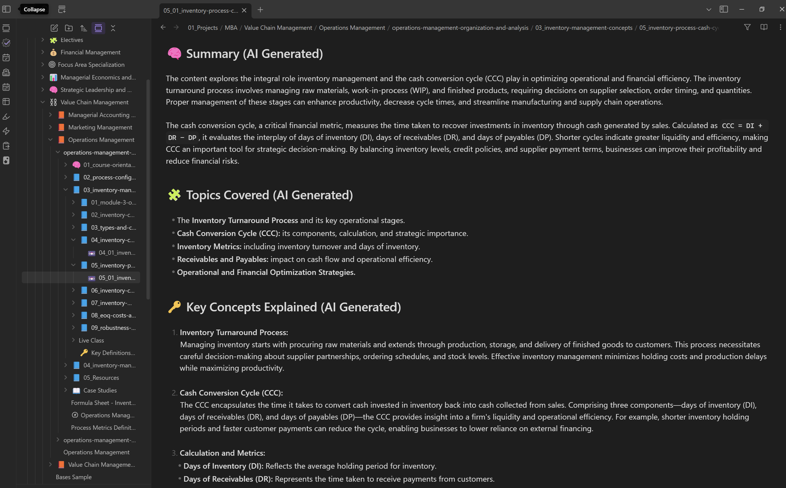
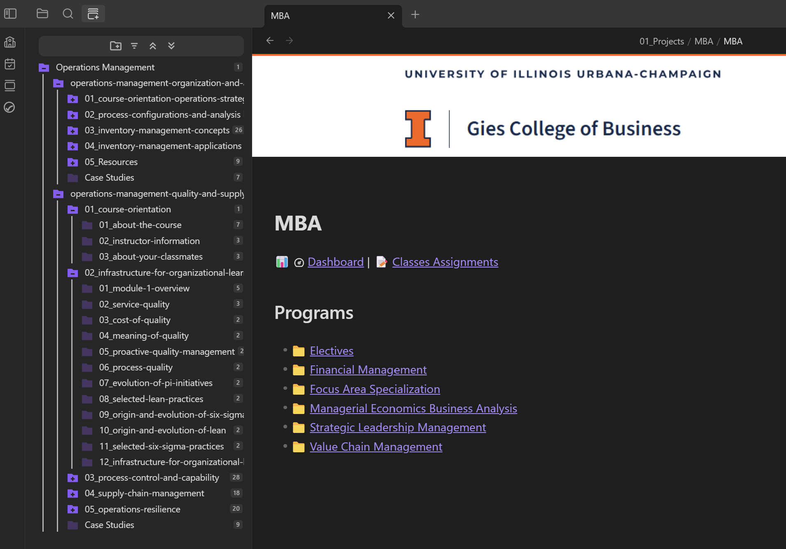
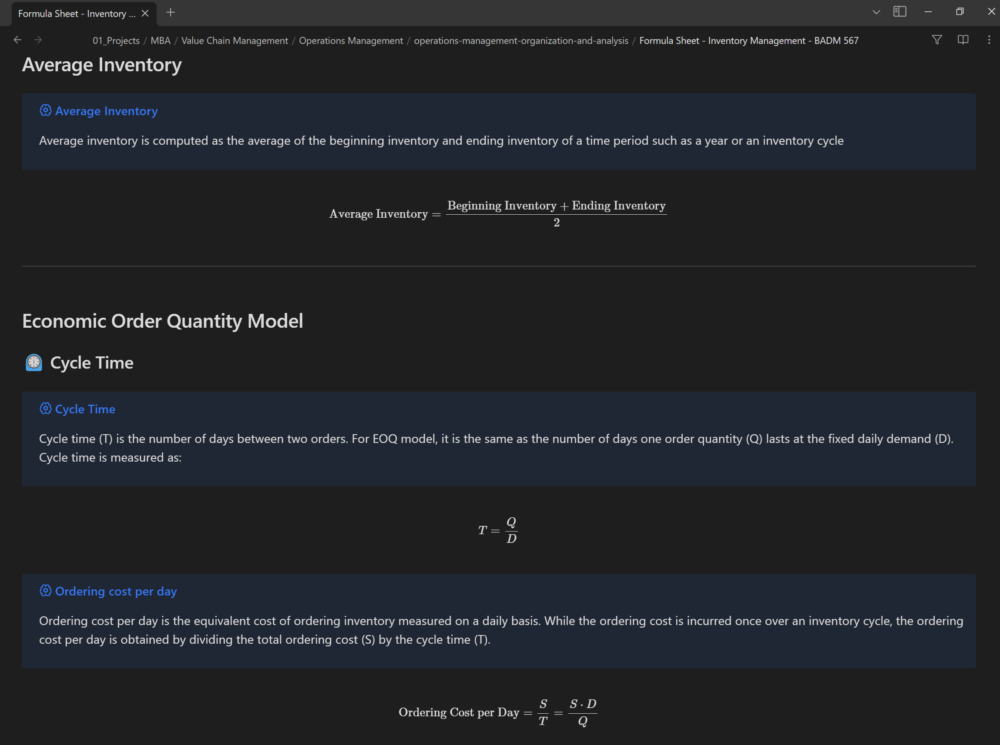
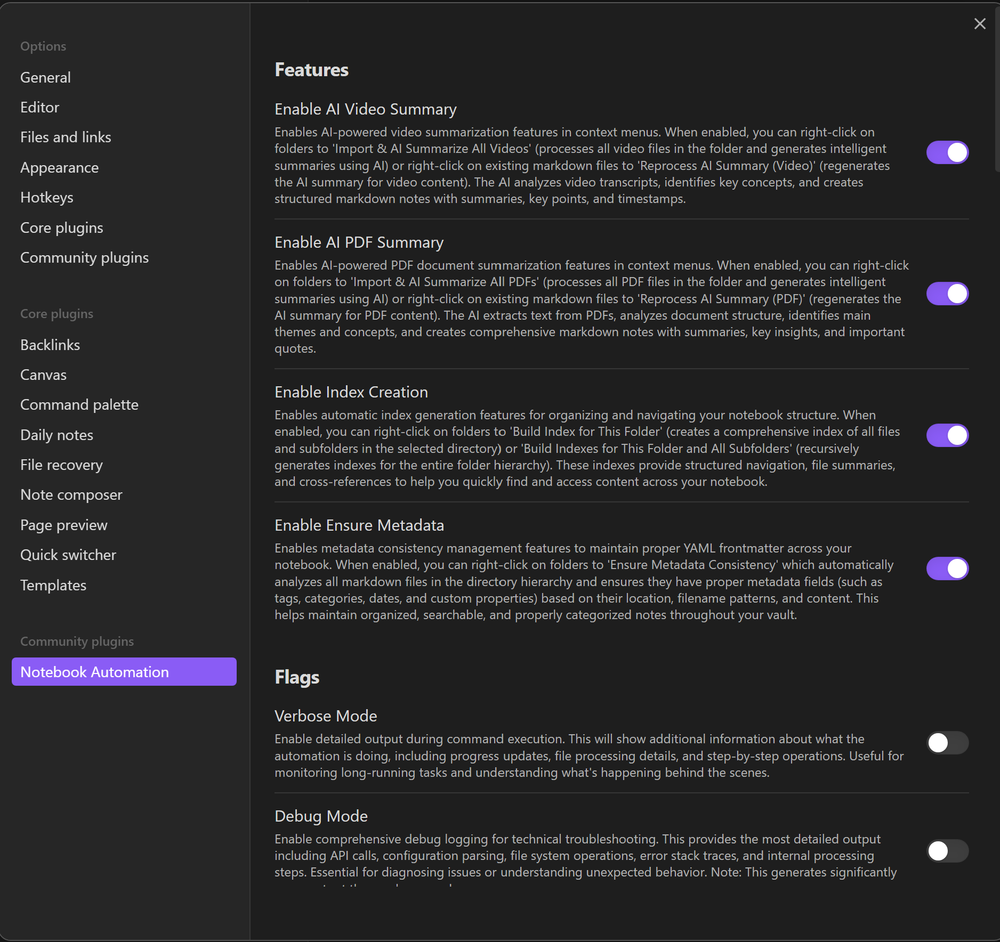
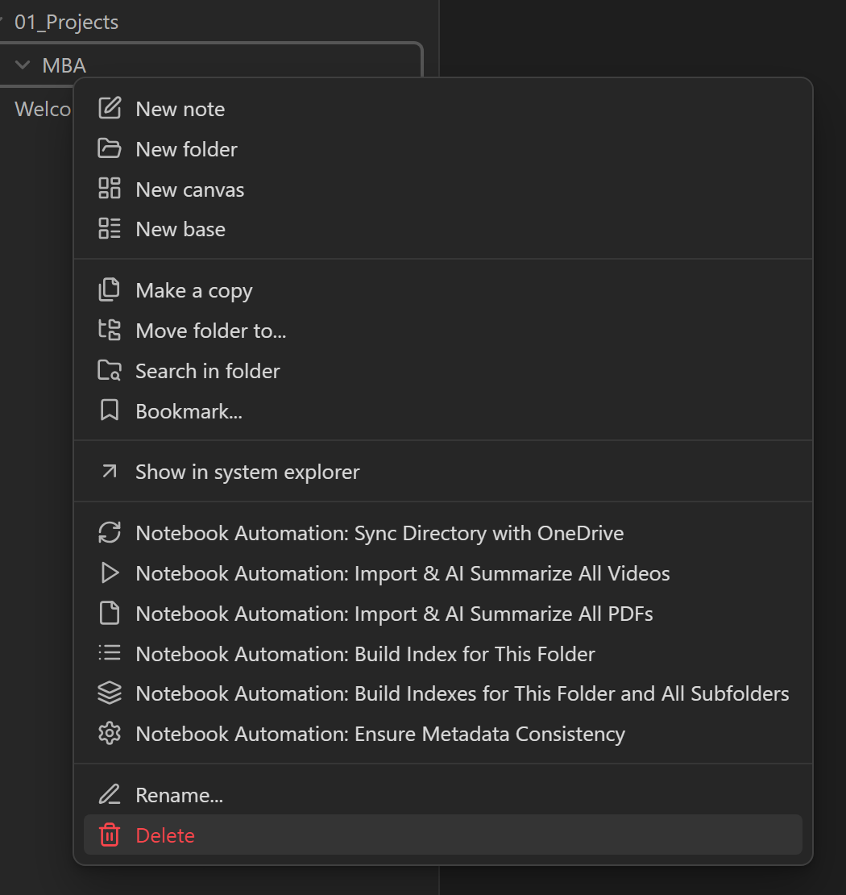

# Notebook Automation

A comprehensive toolkit that transforms educational content into intelligent, searchable knowledge bases. It processes PDFs, extracts annotations, generates AI-powered summaries from videos (with transcripts) and questions/answers, creates hierarchical course structures, and seamlessly integrates with popular tools like Obsidian and Anki for enhanced learning workflows.

## 💡 The Story Behind this Project

Like many students and lifelong learners, I found myself manually collecting course content from various online platforms—downloading PDFs, saving lecture notes, organizing video files, and trying to keep track of assignments across multiple courses. This tedious process consumed hours that could have been spent actually learning.

After spending countless evenings manually organizing course materials, I discovered the brilliant [coursera-dl](https://github.com/coursera-dl/coursera-dl) and [Coursera-Downloader](https://github.com/touhid314/Coursera-Downloader) projects. These tools opened my eyes to the power of automation for educational content management. The coursera-dl project, with its ability to batch download lecture resources and organize them with meaningful names, and the Coursera-Downloader's intuitive GUI for downloading entire courses, showed me what was possible when automation meets education.

Inspired by these projects but needing broader functionality beyond just downloading, I set out to create a comprehensive toolkit that could not only organize content but also analyze, tag, and enhance it with AI-powered insights. The result is Notebook Automation—a project born from the frustration of manual organization and the inspiration of seeing what thoughtful automation could achieve in the educational space.

[](https://github.com/danielshue/notebook-automation/actions)
[](https://github.com/danielshue/notebook-automation/releases/latest)
[](https://opensource.org/licenses/MIT)
[](https://dotnet.microsoft.com/download/dotnet/9.0)

## ✨ Key Features

- **📊 Intelligent Processing** - AI-powered content analysis and summarization
- **🗂️ Obsidian Integration** - Comprehensive vault integration featuring hierarchical course structures, rich YAML frontmatter, contextual menu automation, bidirectional OneDrive synchronization, automated index generation, cross-referenced note linking, and seamless plugin-based workflow management for enhanced knowledge discovery
- **📈 Progress Tracking** - Real-time processing status and logging of course content
- **❓ Question Generation** - AI-powered Q&A creation for study materials
- **📚 Anki Integration** - Export flashcards for spaced repetition learning
- **🎥 Video Transcript Processing** - Generate summaries from video content
- **📄 PDF Annotation Extraction** - Preserve highlights and comments from documents
- **📝 Vocabulary Management** - Extract and organize key terms and definitions
- **📁 Batch Operations** - Process multiple content for note efficiently
- **☁️ OneDrive Folder Synchronization** - Create and maintain folder structures in OneDrive without content transfer for organizational alignment
- **🔗 OneDrive Shared Links Management** - Generate and manage shareable links for collaborative access to course materials and resources
- **🔧 Extensible Architecture** - Plugin system for custom processors

## 📸 Screenshots & Features

### AI-Generated Page Summaries

Each processed document receives an intelligent summary that captures key points, main themes, and actionable insights. These summaries help you quickly review and recall important content.


### AI-Powered Question Generation

The system automatically generates intelligent questions and answers from your course content, perfect for creating study materials and spaced repetition systems. This feature leverages AI to identify key concepts and create meaningful assessment questions.


### Anki Integration for Spaced Repetition

These Questions and Answers can be used to seamlessly export the generated questions to Anki for optimized learning through spaced repetition. The tool creates properly formatted flashcards that integrate with your existing study workflow.


### Obsidian Content Indexes and Class View

#### Navigation Through Indexes

Demonstrate here is the hierarchical navigation system within Obsidian. Using the Bases template system, users can easily explore their course content through structured indexes. These indexes provide a clear overview of programs, courses, modules, and lessons, enabling seamless navigation and quick access to specific sections of the educational material.



#### Class-Level Page Tracking

Highlighting the class-level page view, which tracks individual notes and document statuses. This view allows users to monitor the progress of their course materials, ensuring that all notes and documents are properly organized and up-to-date. It provides a centralized location to manage and review class-specific content efficiently.


### Case Study Analysis Views

Detailed case study notes with structured analysis, key insights, and cross-references. The system automatically formats complex business cases into digestible, searchable content.


### PDF Annotation Processing

Automatically extract and process annotations from PDF documents, preserving highlights, comments, and notes in your knowledge base while maintaining proper attribution and context.


### Rich YAML Frontmatter

Comprehensive metadata extraction creates rich YAML frontmatter with course information, tags, relationships, and custom properties that enhance searchability and organization.


### Vocabulary and Definition Management

Automatically identify and extract key terms and definitions from course materials, creating a searchable vocabulary database with contextual usage examples that can also imported into Anki.



### Obsidian Plugin Integration

#### Comprehensive Settings & Configuration

The Obsidian plugin provides a comprehensive settings interface that allows you to customize every aspect of the automation workflow. From enabling specific AI processing features to configuring file paths and behavior options, the settings panel gives you granular control over how the toolkit integrates with your vault and processes your educational content.The Notebook Automation toolkit has been designed for both command-line interface (CLI) and Obsidian plugin usage, providing users with flexible deployment options to match their preferred workflow. Whether you prefer the precision and automation capabilities of CLI commands or the seamless integration within your Obsidian vault, the system offers extensive and flexible configuration options that adapt to your specific needs and preferences.



#### Contextual Menu Integration

The plugin seamlessly integrates with Obsidian's native interface through context menus, providing instant access to powerful automation features directly from your file explorer. Right-click on any folder or file to access processing options like AI summarization, index generation, and OneDrive synchronization—bringing professional-grade automation tools directly into your daily workflow.



#### OneDrive & Vault Synchronization

The toolkit includes sophisticated synchronization capabilities that bridge your Obsidian vault with OneDrive storage, ensuring your educational content remains accessible across all devices and platforms. The system supports both bidirectional synchronization (default) for seamless two-way updates, and unidirectional synchronization for controlled content flow. This flexible approach allows you to maintain local vault organization while leveraging cloud storage benefits, automatically handling file mapping, conflict resolution, and maintaining metadata consistency between your vault structure and OneDrive folders.

## 📖 Documentation

| Section | Description |
|---------|-------------|
| [**Getting Started**](docs/getting-started/index.md) | Installation, setup, and first steps |
| [**User Guide**](docs/user-guide/index.md) | Comprehensive usage documentation |
| [**Configuration**](docs/configuration/index.md) | Settings and customization options |
| [**Tutorials**](docs/tutorials/index.md) | Step-by-step examples and workflows |
| [**API Reference**](docs/api/index.md) | Detailed API documentation |
| [**Developer Guide**](docs/developer-guide/index.md) | Building and contributing |
| [**Troubleshooting**](docs/troubleshooting/index.md) | Common issues and solutions |

## 🛠️ System Requirements

- **.NET 9.0 SDK** or later
- **Windows 10/11**, **Linux**, or **macOS**
- **PowerShell** (for build scripts)
- **8GB RAM** recommended for large notebook processing

## 🏗️ Project Structure

```
notebook-automation/
├── .github/                     🏗️ CI/CD workflows and templates
├── .vscode/                     🔧 VS Code configuration and tasks
├── src/                         📁 Source code
│   ├── c-sharp/                 🎯 Core C# application
│   │   ├── NotebookAutomation.Core/  📚 Main processing library
│   │   ├── NotebookAutomation.Cli/   💻 Command-line interface
│   │   └── NotebookAutomation.Tests/ 🧪 Unit and integration tests
│   ├── obsidian-plugin/         🔌 Obsidian plugin for integration
│   └── tests/                   🔬 Additional test resources
├── docs/                        📖 Documentation site
├── config/                      ⚙️ Configuration templates
├── scripts/                     🔧 Build and utility scripts
├── tasks/                       📋 Project task documentation
├── tests/                       🎯 Test fixtures and data
├── prompts/                     🤖 AI prompt templates
└── logs/                        📝 Application logs
```

## 🎯 Use Cases

- **Academic Research** - Organize course notebooks and assignments
- **Data Science Projects** - Standardize analysis workflows
- **Educational Content** - Prepare teaching materials
- **Documentation** - Generate reports from exploratory analysis
- **Archive Management** - Organize and categorize notebook collections

## 🤝 Contributing

We welcome contributions! Please see our [Contributing Guide](docs/developer-guide/contributing.md) for details.

1. Fork the repository
2. Create a feature branch
3. Make your changes
4. Add tests and documentation
5. Submit a pull request

## 📄 License

This project is licensed under the MIT License - see the [LICENSE](LICENSE.md) file for details.

## 🙋 Support

- **Issues**: [GitHub Issues](https://github.com/danielshue/notebook-automation/issues)
- **Discussions**: [GitHub Discussions](https://github.com/danielshue/notebook-automation/discussions)
- **Documentation**: [Project Documentation](docs/index.md)

---

<div align="center">

**[📖 Read the Docs](docs/index.md)** • **[🚀 Quick Start](docs/getting-started/index.md)** • **[💡 Examples](docs/tutorials/index.md)**

</div>
