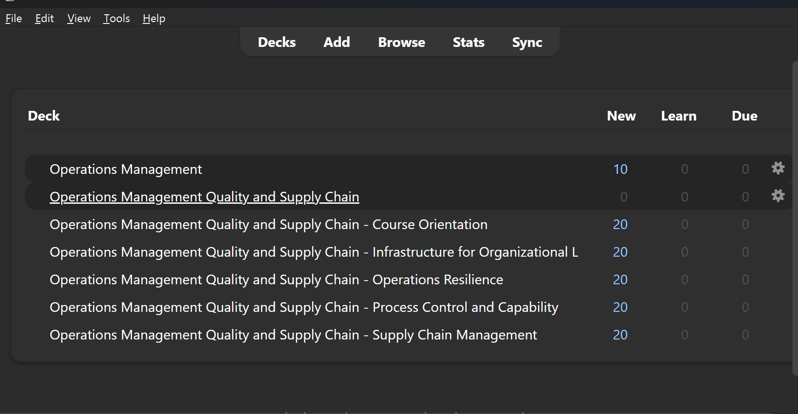
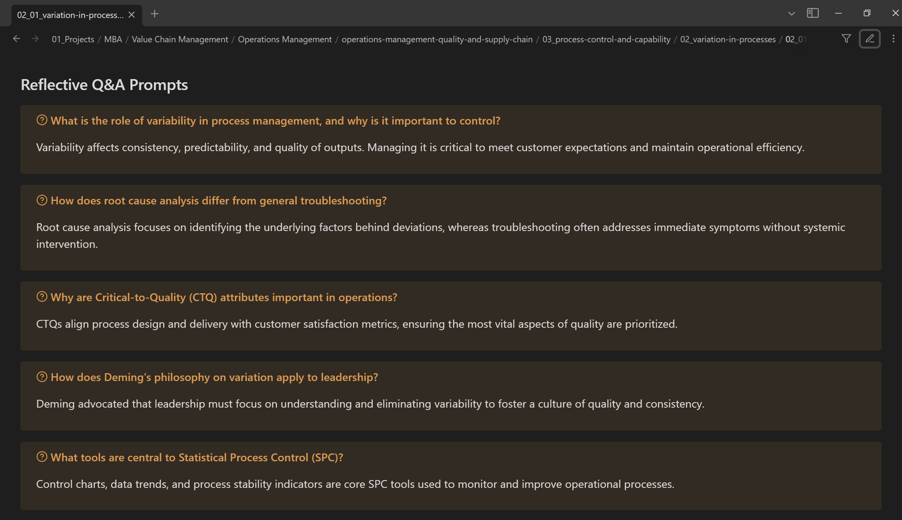
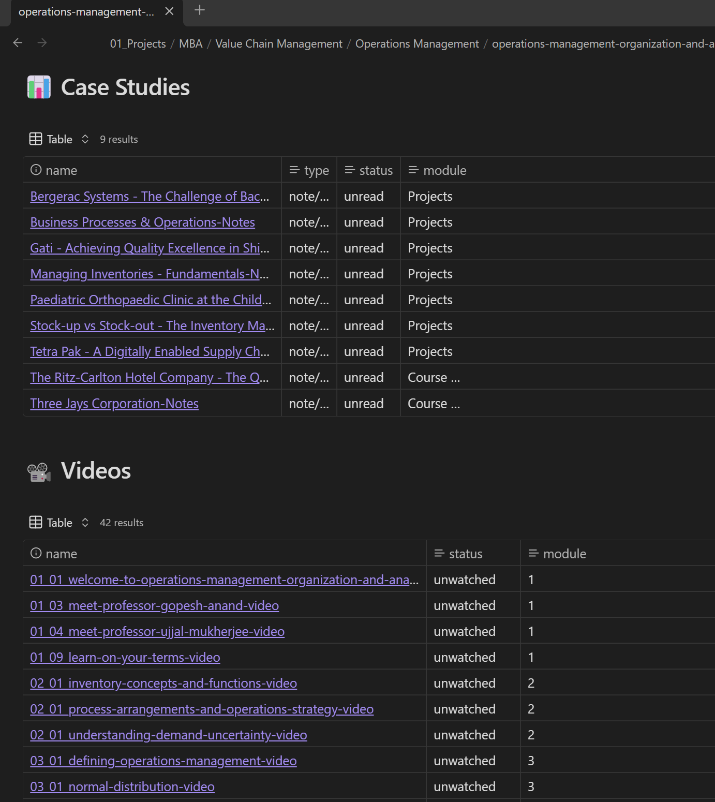
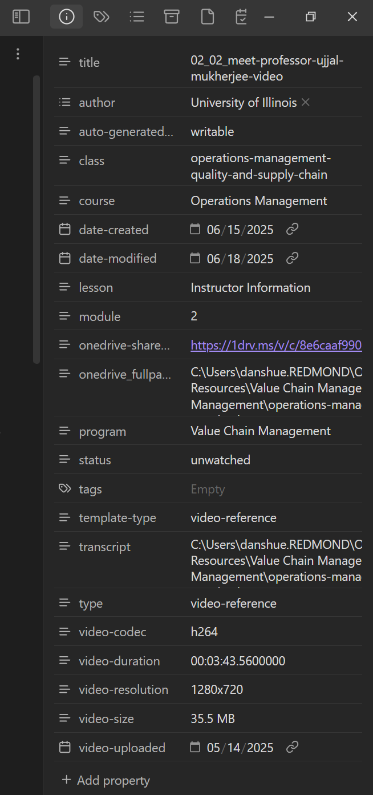
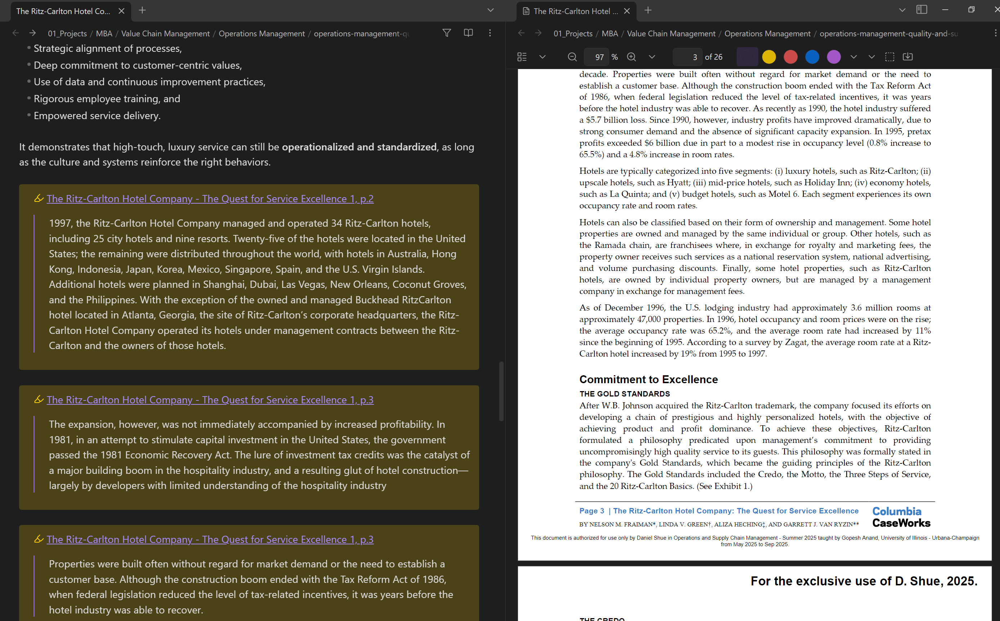

# Notebook Automation

A comprehensive, cross-platform toolkit for automating the management and organization of educational content in Obsidian vaults. This project provides intelligent content processing, metadata extraction, and seamless integration between OneDrive resources and Obsidian knowledge management systems.

> **💡 Project Inspiration**: This project was inspired by popular course download tools like [coursera-dl](https://github.com/coursera-dl/coursera-dl) and [Coursera-Downloader](https://github.com/danielshue/Coursera-Downloader), which enable downloading the course materials from Coursera. While these tools solve the downloading challenge, Notebook Automation fills the next crucial step: intelligently organizing, annotating, and connecting those downloaded materials within a structured knowledge management system. It transforms raw course artifacts into a cohesive, searchable, and navigable learning resource enhanced with AI-powered summaries, metadata extraction, and seamless note-taking capabilities.

## 🌟 Overview

Notebook Automation transforms the way you manage course materials, whether for MBA programs, online courses, or any structured educational content. It automates the tedious tasks of organizing files, extracting metadata, generating summaries, and maintaining consistency across your knowledge base.


### Key Capabilities

- **🤖 Intelligent Content Processing**: Automatically converts PDFs, video transcripts, HTML, and other formats to structured Markdown notes
- **📊 Metadata Extraction**: Smart detection of course hierarchy, programs, modules, and lessons from file paths and content
- **🏷️ Advanced Tag Management**: Hierarchical tag generation and consolidation for enhanced content discovery
- **☁️ OneDrive Integration**: Seamless file access, sharing, and synchronization with Microsoft Graph API
- **🧠 AI-Powered Summaries**: OpenAI and Azure AI integration for generating content summaries and insights
- **❓ AI Question Generation**: Automatically creates questions and answers from content for spaced repetition systems like [Anki](https://apps.ankiweb.net/)
- **📚 Index Generation**: Automated creation of navigation structures and dashboards
- **🔄 Cross-Platform Support**: Modern C# CLI application with .NET 9.0 runtime

### AI-Enhanced Course Notes with Structured Content

Comprehensive course note with AI-generated summary, structured metadata, and organized content sections including objectives, key concepts, and action items.


### Spaced Repetition Learning Integration

Anki flashcard review interface showing AI-generated questions exported from course content, enabling spaced repetition learning with course-specific terminology and concepts.



### Automated Question and Answer Generation

Automated question and answer generation from course materials, creating study content in structured format ready for export to spaced repetition systems.



### Intelligent PDF Processing and Annotation Extraction

PDF processing results showing extracted text, annotations, and metadata automatically converted to structured Markdown with preserved formatting and references.


### Vocabulary and Definition Management

Use of terminology and definitions from course content, organized in searchable format with cross-references and hierarchical categorization.


### Database-Style Course Organization

Database-style view of course materials using Obsidian Bases plugin, showing structured metadata, progress tracking, and filterable course content organization.



### Rich Metadata Extraction and Management

Detailed YAML frontmatter showing comprehensive metadata extraction including course hierarchy, tags, dates, and custom properties for enhanced content organization.



### Integrated Study Workflow with Source Materials

Side-by-side view of processed course notes alongside the original PDF using PDF++ plugin, demonstrating seamless integration between generated markdown content and source materials for comprehensive study workflow.



### 📋 Document Navigation

**For Users:**

- [⚡ Quick Start](#-quick-start) - Installation and setup
- [🚀 Core Features](#-core-features) - Usage examples and commands
- [🔧 Configuration](#-configuration) - System configuration options

**For Developers:**

- [🔧 Developer Documentation](#-developer-documentation) - Building from source and contributing

## 🏗️ Architecture

The project is built as a modern .NET Core application with a clean architecture pattern:

```text
notebook-automation/
├── src/
│   └── c-sharp/          # .NET Core CLI application
│       ├── NotebookAutomation.Core/      # Core business logic
│       ├── NotebookAutomation.Cli/       # Command-line interface
│       └── NotebookAutomation.*.Tests/   # Unit tests
├── docs/                 # Documentation
├── scripts/              # Build and utility scripts
├── config/               # Configuration files
│   ├── config.json       # Configuration template
│   └── metadata.yaml     # Content type definitions
```

## ⚡ Quick Start

### Prerequisites

- **For AI features**: OpenAI API key or Azure Cognitive Services
- **For OneDrive**: Microsoft Graph API access (optional)

> **Note**: No .NET SDK installation required when using pre-built executables.

### Installation

Download the latest pre-built executable from [GitHub Releases](https://github.com/danielshue/notebook-automation/releases):

```pwsh
# Download and extract na.exe to your preferred location
# Add to PATH for global access
na.exe --help

# Or rename to na for convenience
na --help
```

> **💡 For Developers**: If you want to build from source or contribute to the project, see the [Development & Testing](#-development--testing) section below.

### Initial Configuration

```pwsh
# View current configuration
na config view

# List all available configuration keys
na config list-keys

# Update specific settings

# Essential Path Configuration
na config update notebook_vault_fullpath_root "C:/Users/yourname/Vault"
na config update onedrive_fullpath_root "C:/Users/yourname/OneDrive"
na config update paths.onedrive_resources_basepath "/Education/Course-Resources"
na config update paths.prompts_path "D:/source/notebook-automation/prompts"
na config update paths.logging_dir "D:/source/notebook-automation/logs"

# AI Service Provider Configuration (Choose one)

# Option 1: Azure OpenAI (Recommended)
na config update aiservice.provider "azure"
na config update aiservice.azureopenai.endpoint "https://your-resource.cognitiveservices.azure.com/"
na config update aiservice.azureopenai.deployment "gpt-4o"
na config update aiservice.azureopenai.model "gpt-4o"
# Note: API key should be set via User Secrets (see na config display-secrets)

# Option 2: OpenAI API
na config update aiservice.provider "openai"
na config update aiservice.openai.endpoint "https://api.openai.com/v1/chat/completions"
na config update aiservice.openai.model "gpt-4o"
# Note: API key should be set via User Secrets (see na config display-secrets)

# Option 3: Local Foundry/LM Studio
na config update aiservice.provider "foundry"
na config update aiservice.foundry.endpoint "http://localhost:8000/v1/chat/completions"
na config update aiservice.foundry.model "your-local-model-name"

# Microsoft Graph Configuration (for OneDrive integration)
na config update microsoft_graph.client_id "your-app-registration-id"
na config update microsoft_graph.scopes "Files.ReadWrite.All,Sites.Read.All"

# Video Processing Settings
na config update video_extensions ".mp4,.mov,.avi,.mkv,.webm,.flv,.wmv"

# Check user secrets status
na config display-secrets
```

## 🚀 Core Features

### Storage Architecture Philosophy

Notebook Automation uses a **hybrid storage approach** that separates content types for optimal performance and organization:

#### **Obsidian Vault (Lightweight Notes)**

- **Markdown files** with metadata and references
- **Small assets** like images and diagrams
- **Index files** and navigation structures
- **Tags and cross-references** for knowledge linking

#### **OneDrive (Large Media Files)**

- **Video files** (lectures, presentations, recordings)
- **Large PDF documents** and textbooks
- **Audio files** and transcripts
- **Bulk course materials** and resources

#### **Why This Split?**

**Performance Benefits:**

- **Faster Obsidian sync** - Vault contains only lightweight text files
- **Reduced storage overhead** - No large binaries cluttering the knowledge graph
- **Improved search speed** - Text-only indexing for rapid note discovery
- **Better version control** - Git-friendly vault with meaningful diffs

**Organizational Advantages:**

- **Centralized media storage** - OneDrive handles large files with proper cloud sync
- **Shareable links** - Direct access to videos/PDFs without vault dependency
- **Cross-platform access** - Media available on mobile/web without Obsidian
- **Backup efficiency** - Separate backup strategies for notes vs. large files

**User Experience:**

- **Smart references** - Notes contain metadata and links to actual media files
- **Automatic linking** - Tool generates OneDrive share links for seamless access
- **Offline capability** - Essential notes available even when media isn't cached
- **Scalable growth** - Add thousands of videos without impacting vault performance

This architecture ensures your **knowledge base remains fast and navigable** while keeping all related media **easily accessible and properly organized**.

#### **Recommended Obsidian Plugins**

To maximize the effectiveness of Notebook Automation, these Obsidian plugins enhance the user experience:

- **[Banners](https://github.com/noatpad/obsidian-banners)** - Adds visual banners to notes for better organization and visual appeal
- **[Export to Anki](https://github.com/ObsidianToAnki/Obsidian_to_Anki)** - Seamlessly exports AI-generated questions and answers and course terminology and definitions to Anki for spaced repetition
- **[Bases](https://help.obsidian.md/bases)** - Creates structured database-like views for course materials and metadata
- **[PDF++](https://github.com/RyotaUshio/obsidian-pdf-plus)** - Enhanced PDF viewing and annotation capabilities within Obsidian for seamless integration with processed course materials

### Content Processing Commands

#### PDF Processing

Convert PDF documents to structured Markdown notes with metadata:

```pwsh
# Process single PDF file
na pdf-notes --input "C:/Documents/course-material.pdf"

# Process entire directory with verbose output
na pdf-notes --input "C:/Course/PDFs" --verbose

# Force overwrite existing notes
na pdf-notes --input "C:/Documents/syllabus.pdf" --force

# Skip AI summary generation (faster processing)
na pdf-notes --input "C:/Course/PDFs" --no-summary

# Extract images from PDFs and include in markdown
na pdf-notes --input "C:/Documents/research-paper.pdf" --extract-images

# Override default vault root location
na pdf-notes --input "C:/Documents/paper.pdf" --override-vault-root "D:/MyVault"

# Set custom timeout for large files (in seconds)
na pdf-notes --input "C:/Course/LargeTextbook.pdf" --timeout 300

# Skip OneDrive share link creation
na pdf-notes --input "C:/Documents/private.pdf" --no-share-links

# Retry only failed files from previous run
na pdf-notes --input "C:/Course/PDFs" --retry-failed

# Dry run to preview changes without processing
na pdf-notes --input "C:/Documents/" --dry-run --verbose
```

#### Video Processing

Extract metadata and create reference notes for video content:

```pwsh
# Process single video file
na video-notes --input "C:/Course/Lectures/lecture-01.mp4"

# Process entire directory of videos
na video-notes --input "C:/Course/Videos" --verbose

# Force overwrite existing video notes
na video-notes --input "C:/Videos/presentation.mp4" --force

# Skip AI summary generation for faster processing
na video-notes --input "C:/Course/Videos" --no-summary

# Skip OneDrive share link creation (for private content)
na video-notes --input "C:/Personal/videos" --no-share-links

# Override default output directory
na video-notes --input "C:/Downloads/lecture.mp4" --overwrite-output-dir "D:/CourseNotes"

# Set custom vault root for specific project
na video-notes --input "C:/MBA/videos" --override-vault-root "D:/MBA-Vault"

# Set timeout for large video files (in seconds)
na video-notes --input "C:/Course/long-lecture.mp4" --timeout 600

# Retry failed videos from previous batch
na video-notes --input "C:/Course/Videos" --retry-failed

# Force refresh OneDrive authentication
na video-notes --input "C:/Course/Videos" --refresh-auth

# Preview changes without actual processing
na video-notes --input "C:/Videos/" --dry-run --verbose
```

#### Markdown Generation

Convert HTML, TXT, and EPUB formats to Obsidian-compatible Markdown:

```pwsh
# Convert files from source directory to vault
na generate-markdown --src-dirs "C:/Downloads/CourseHTML" --dest-dir "C:/Vault/Courses"

# Convert multiple source directories
na generate-markdown --src-dirs "C:/Course/HTML,C:/Course/TXT" --dest-dir "C:/Vault/Notes"

# Override vault root for specific conversion
na generate-markdown --src-dirs "C:/WebContent" --override-vault-root "D:/ProjectVault"

# Preview conversion without making changes
na generate-markdown --src-dirs "C:/Downloads/HTML" --dest-dir "C:/Vault" --dry-run --verbose

# Enable debug output for troubleshooting
na generate-markdown --src-dirs "C:/Content" --dest-dir "C:/Notes" --debug
```

### Tag Management

#### Hierarchical Tag Generation

Automatically generate nested tags based on content metadata:

```pwsh
# Add nested tags based on frontmatter fields
na tag add-nested "C:/Vault/Courses" --verbose

# Preview tag changes without applying them
na tag add-nested "C:/Vault/MBA" --dry-run --verbose

# Add tags with debug output for troubleshooting
na tag add-nested "C:/Vault/Projects" --debug

# Add example tags to a specific file
na tag add-example "C:/Vault/Notes/sample.md" --verbose

# Check and enforce metadata consistency
na tag metadata-check "C:/Vault/Courses" --verbose

# Update specific frontmatter key-value pair
na tag update-frontmatter "C:/Vault/Notes/course.md" "program" "Data Science"

# Diagnose YAML frontmatter issues
na tag diagnose-yaml "C:/Vault/Notes/problematic-file.md" --debug
```

#### Tag Maintenance

Clean up and consolidate existing tags:

```pwsh
# Remove duplicates and sort tags in files
na tag consolidate "C:/Vault/Notes" --verbose

# Preview tag consolidation changes
na tag consolidate "C:/Vault/Courses" --dry-run --verbose

# Clean tags from index files
na tag clean-index "C:/Vault/MBA" --verbose

# Preview index tag cleaning
na tag clean-index "C:/Vault/Projects" --dry-run

# Restructure tags for consistency across vault
na tag restructure "C:/Vault" --verbose

# Restructure with debug output
na tag restructure "C:/Vault/Courses" --debug --verbose

# Check specific file metadata consistency
na tag metadata-check "C:/Vault/Notes/specific-file.md" --debug
```

### Metadata Management

#### Automatic Metadata Extraction

Ensure consistent metadata across your vault:

```pwsh
# Ensure metadata consistency across entire vault
na vault ensure-metadata "C:/Vault" --verbose

# Process specific course directory
na vault ensure-metadata "C:/Vault/MBA/Finance" --verbose

# Preview metadata changes without applying them
na vault ensure-metadata "C:/Vault/Courses" --dry-run --verbose

# Debug metadata extraction process
na vault ensure-metadata "C:/Vault/Projects/DataScience" --debug
```

#### Index Generation

Create navigation structures and dashboards:

```pwsh
# Generate index files for all directories in vault
na vault generate-index "C:/Vault" --verbose

# Generate indexes for specific course
na vault generate-index "C:/Vault/MBA/Operations" --verbose

# Preview index generation without creating files
na vault generate-index "C:/Vault/Courses" --dry-run --verbose

# Clean/delete all existing index files in vault
na vault clean-index "C:/Vault" --verbose

# Preview index cleaning operation
na vault clean-index "C:/Vault/Projects" --dry-run

# Generate indexes with debug information
na vault generate-index "C:/Vault/DataScience" --debug --verbose
```

## 🔧 Configuration

The system uses a centralized `config/config.json` file for all settings. Key configuration areas include:

### Paths Configuration

```json
{
  "paths": {
    "onedrive_fullpath_root": "C:/Users/username/OneDrive",
    "notebook_vault_fullpath_root": "D:/Vault/Projects/Education",
    "metadata_file": "config/metadata.yaml",
    "logging_dir": "logs"
  }
}
```

### AI Services

```json
{
  "aiservice": {
    "provider": "azure",
    "azure": {
      "endpoint": "https://your-resource.cognitiveservices.azure.com/",
      "deployment": "gpt-4o",
      "model": "gpt-4o"
    }
  }
}
```

### Microsoft Graph Integration

```json
{
  "microsoft_graph": {
    "client_id": "your-app-id",
    "scopes": ["Files.ReadWrite.All", "Sites.Read.All"]
  }
}
```

For detailed configuration options, see [Configuration Guide](docs/UserSecrets.md).

---

## 🔧 Developer Documentation

This section is for developers who want to build from source, contribute to the project, or understand the technical implementation details.

### 📖 Technical Documentation

- **[Metadata Extraction System](docs/Metadata-Extraction-System.md)** - How the system intelligently extracts and assigns metadata
- **[User Secrets Guide](docs/UserSecrets.md)** - Secure configuration of API keys and credentials
- **[C# Documentation](src/c-sharp/README.md)** - .NET implementation and development setup
- **[Configuration System Design](docs/Configuration-System-Design.md)** - Detailed configuration options and setup

### 🧪 Development & Testing

#### Building from Source

If you prefer to build the application yourself or want to contribute:

```pwsh
# Clone the repository
git clone https://github.com/danielshue/notebook-automation.git
cd notebook-automation/src/c-sharp

# Restore dependencies
dotnet restore

# Build the solution
dotnet build NotebookAutomation.sln

# Run tests
dotnet test

# Run directly from source
dotnet run --project NotebookAutomation.Cli -- --help
```

#### Local CI Build

Test the complete build pipeline locally:

```pwsh
# Full build with tests
pwsh -File scripts/build-ci-local.ps1

# Quick build without tests
pwsh -File scripts/build-ci-local.ps1 -SkipTests

# Format code only
pwsh -File scripts/build-ci-local.ps1 -SkipTests -SkipFormat
```

#### Available VS Code Tasks

- `build-dotnet-sln` - Build the C# solution
- `local-ci-build` - Run complete CI pipeline locally
- `local-ci-build-skip-tests` - Build without running tests
- `dotnet-format-solution` - Format C# code

### 🤝 Contributing

1. **Fork the repository** and create a feature branch
2. **Follow coding standards**:
   - C#: Microsoft conventions with modern C# features (C# 12+)
   - Use file-scoped namespaces and primary constructors where appropriate
3. **Add tests** for new functionality
4. **Update documentation** as needed
5. **Submit a pull request** with clear description

#### Coding Guidelines

- Use dependency injection for testability
- Implement comprehensive error handling
- Follow the existing project structure
- Write XML documentation for all public APIs
- Ensure cross-platform compatibility
- Follow Microsoft C# coding conventions

## 📊 Project Status

### Current Features

- ✅ PDF to Markdown conversion with metadata
- ✅ Video metadata extraction and note generation
- ✅ Hierarchical tag management system
- ✅ OneDrive integration via Microsoft Graph
- ✅ AI-powered content summarization
- ✅ Cross-platform CLI application (.NET 9.0)
- ✅ Automated metadata extraction
- ✅ Index and dashboard generation

### Roadmap

- 🔄 Plugin system for custom AI processors prompts

## 📄 License

This project is licensed under the MIT License - see the [LICENSE](LICENSE) file for details.

## 🙋 Support

- **Issues**: Report bugs or request features on [GitHub Issues](https://github.com/danielshue/notebook-automation/issues)
- **Discussions**: Join the community on [GitHub Discussions](https://github.com/danielshue/notebook-automation/discussions)
- **Documentation**: Browse the [docs](docs/) folder for detailed guides

---

Made with ❤️ for the education and knowledge management community
<!-- CI Build Test - 06/16/2025 08:58:41 -->
