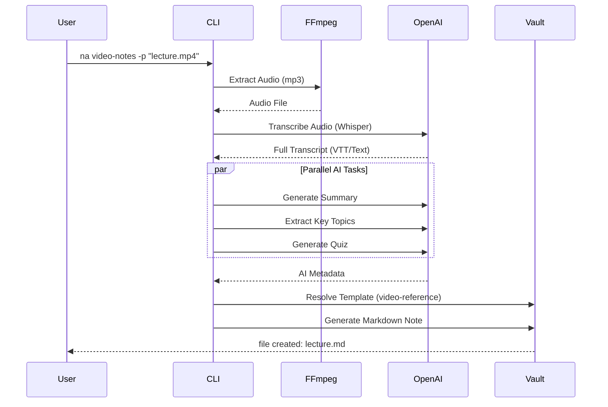
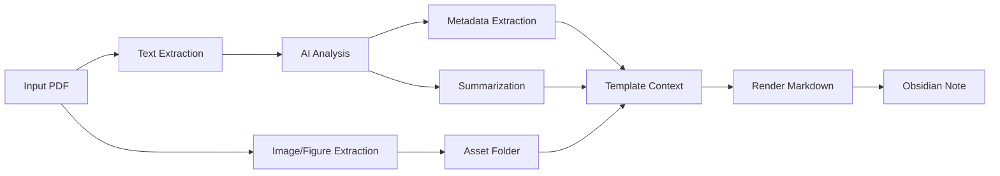

# Processing Pipeline

This document details the step-by-step flow of how raw content (Videos, PDFs) is transformed into structured Obsidian notes.

## 1. Video Processing Pipeline

The video processing pipeline transforms raw video files into comprehensive study notes with transcripts and AI summaries.

### Stages
1. **Ingestion**: Validates input file and checks cache/history to avoid re-processing.
2. **Audio Extraction**: Converts video to optimized audio format for transcription.
3. **Transcription**: Uses AI to convert speech to text with timestamps.
4. **Enrichment**: Sends transcript to LLM to generate:
    - **Summary**: High-level overview.
    - **Key Concepts**: Bullet points of main topics.
    - **Quiz**: Self-assessment questions.
5. **Generation**: Merges all data into a Handlebars template to create the final `.md` file.

## 2. PDF Processing Pipeline

The PDF pipeline focuses on extracting text, annotations, and visual elements.

### Stages
1. **Extraction**:
    - **Text**: Pulls raw text for analysis.
    - **Images**: Extracts embedded images/figures and saves them to the vault's assets folder.
2. **Analysis**:
    - AI analyzes the text to identify the Title, Authors, and Publication Date if not present in metadata.
    - Generates a concise summary of the paper/book.
3. **Output**: Creates a structured note linking to the extracted images and the original PDF.

## 3. Metadata & Tagging Pipeline

Ensures consistency across the vault.

1. **Frontmatter Validation**: Checks if existing notes match the schema.
2. **Tag Consolidation**: Merges synonyms (e.g., `#ai` vs `#artificialinteractive`) based on user rules.
3. **Index Generation**: Crawls directories and builds `_index.md` files (MOCs) for navigation.
