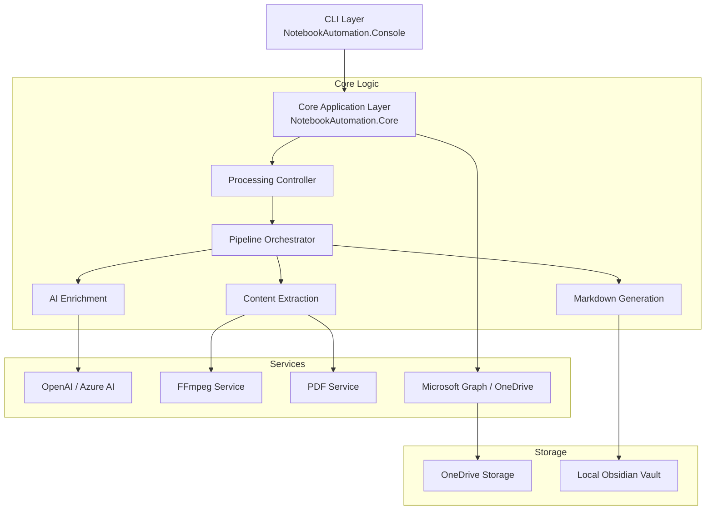

# System Overview

This document provides a high-level overview of the Notebook Automation architecture, explaining how the different components interact to process content and generate knowledge.

## High-Level Architecture

The solution is built on a layered architecture that separates the command-line interface from the core business logic, ensuring testability and extensibility.

## Key Components

### 1. CLI Layer (`NotebookAutomation.Console`)
The entry point for the application. It handles parameter parsing, command routing, and user interaction.
- **Library**: Uses `System.CommandLine` for robust argument parsing.
- **Responsibility**: Validation, configuration loading, and invoking core services.

### 2. Core Application (`NotebookAutomation.Core`)
Contains the business logic and orchestrators.
- **Pipeline Orchestrator**: Manages the flow of data from input to output.
- **Service Interfaces**: Defines contracts for external dependencies (AI, Storage).

### 3. Service Integrations
- **AI Services**: Abstraction layer for LLM providers (OpenAI, Azure OpenAI) to generate summaries, quizzes, and metadata.
- **Media Processing**: Wrappers around FFmpeg for video processing and audio extraction.
- **Document Processing**: PDF parsing logic for text and image extraction.

### 4. Storage & Sync
- **Local Vault**: Direct file system manipulation for the Obsidian vault (Markdown files).
- **OneDrive**: Integration via Microsoft Graph API for syncing large assets and maintaining a "Location Agnostic" design.

## Design Principles

- **Location Agnostic**: The system works regardless of where the file originates (local or cloud).
- **Convention over Configuration**: Uses valid defaults for vault structure while allowing overrides.
- **Dependency Injection**: All services are injected, allowing for easy mocking and testing.
