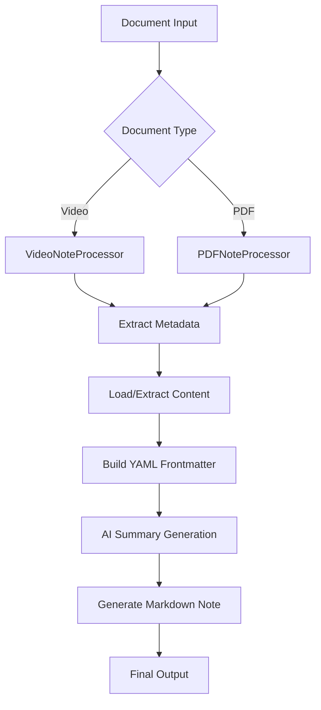

# AI Summary Processing Flow

This document provides a comprehensive overview of how the Notebook Automation system processes video and PDF files to generate AI-powered summaries and markdown notes.

## Overview

The AI summary processing system handles two main document types:
- **Video files** (MP4, AVI, etc.) using transcript files
- **PDF files** with text extraction capabilities

The system follows a sophisticated chunking and aggregation strategy to handle large content while maintaining context and coherence.

## High-Level Architecture



## Detailed Processing Flow

### Phase 1: Document Analysis and Metadata Extraction

#### For Video Files (`VideoNoteProcessor`)

1. **Metadata Extraction** (`ExtractMetadataAsync`)
   - Uses `Xabe.FFmpeg` to extract video properties (duration, resolution, codec)
   - Extracts file system metadata (size, creation date)
   - Applies hierarchical metadata detection based on file path
   - Generates friendly title from filename

2. **Transcript Discovery** (`TryLoadTranscript`)
   - Searches for transcript files in prioritized order:
     - Language-specific transcripts (e.g., `video.en.txt`, `video.zh-cn.txt`)
     - Generic transcripts (`video.txt`, `video.md`)
     - Transcripts in `Transcripts` subdirectory
   - Handles name normalization (hyphens ↔ underscores)

3. **OneDrive Integration** (Optional)
   - Generates share links if `IOneDriveService` is available
   - Maps local paths to OneDrive paths for metadata

#### For PDF Files (`PDFNoteProcessor`)

1. **PDF Text Extraction**
   - Uses PDF processing libraries to extract text content
   - Handles OCR for image-based PDFs (if configured)
   - Maintains document structure and formatting

2. **Metadata Extraction**
   - Extracts PDF document properties
   - Applies hierarchical metadata detection
   - Generates appropriate titles and categorization

### Phase 2: YAML Frontmatter Generation

The system builds comprehensive YAML frontmatter containing:

```yaml
title: "Document Title"
template-type: "video-reference" | "pdf-reference"
auto-generated-state: "writable"
type: "note/video" | "note/pdf"
date-created: "2025-06-13"
program: "MBA Program"
course: "Course Name"
class: "Class Name"
module: "Module Number"
lesson: "Lesson Name"
status: "unread" | "read"
tags: []
# Video-specific fields
video-duration: "01:29:22"
video-resolution: "1920x1080"
video-codec: "h264"
onedrive-shared-link: "https://..."
transcript: "path/to/transcript.txt"
# PDF-specific fields
pdf-pages: 45
pdf-size: "2.3 MB"
```

### Phase 3: AI Summary Generation

This is the core of the system and involves sophisticated text processing:

#### Entry Point

All processing starts in the document processor's `GenerateAiSummaryAsync` method:

```csharp
// VideoNoteProcessor.GenerateAiSummaryAsync (line 205)
public override async Task<string> GenerateAiSummaryAsync(
    string? text,
    Dictionary<string, string>? variables = null,
    string? promptFileName = null)
```

#### Variable Preparation

The system prepares variables for prompt template substitution:

- `title`: Document title
- `course`: Course information
- `onedrivePath`: OneDrive path mapping
- `yamlfrontmatter`: **Complete YAML frontmatter block** (critical for template injection)

#### Text Size Decision Point

```csharp
// AISummarizer.SummarizeWithVariablesAsync (line 501)
if (processedInputText.Length > maxChunkTokens) // 8,000 characters
{
    return await SummarizeWithChunkingAsync(...);
}
else
{
    return await SummarizeWithSemanticKernelAsync(...);
}
```

### Phase 4A: Direct Processing (Small Documents)

For documents under 8,000 characters:

1. **Template Loading**: Load `final_summary_prompt.md` directly
2. **Variable Substitution**: Replace `{{variables}}` and `[yamlfrontmatter]`
3. **AI Processing**: Single AI call with complete content
4. **Return Result**: Generated markdown content

### Phase 4B: Chunking Process (Large Documents)

For documents over 8,000 characters, the system uses a sophisticated two-stage process:

#### Stage 1: Chunk Processing

```csharp
// AISummarizer.SummarizeWithChunkingAsync (line 570)
```

1. **Text Chunking**:
   - Split input into 8,000-character chunks with 500-character overlap
   - Maintains context continuity across chunk boundaries
   - Uses `ITextChunkingService` for intelligent splitting

2. **Chunk Template Loading**:
   ```csharp
   // Load chunk_summary_prompt.md
   string? chunkPromptTemplate = await LoadChunkPromptAsync();
   ```

3. **Parallel Chunk Processing** (if configured):
   ```csharp
   if (timeoutConfig.MaxChunkParallelism > 1 && chunks.Count > 1)
   {
       chunkSummaries = await ProcessChunksInParallelAsync(...);
   }
   ```

4. **Individual Chunk Summarization**:
   - Each chunk processed with `chunk_summary_prompt.md`
   - Optimized for MBA coursework content
   - Focuses on key concepts and frameworks

#### Stage 2: Summary Aggregation

```csharp
// Load final_summary_prompt.md for aggregation
string? finalPromptTemplate = await LoadFinalPromptAsync();
```

**🔑 CRITICAL POINT**: This is where `final_summary_prompt.md` gets read and used.

1. **Input Preparation**:
   - Concatenate all chunk summaries (NOT original transcript)
   - Prepare variables including complete YAML frontmatter

2. **Template Processing**:
   ```csharp
   // Variable substitution order:
   prompt = promptService.SubstituteVariables(prompt, variables);      // {{variables}}
   prompt = prompt.Replace("[yamlfrontmatter]", yamlValue);            // [yamlfrontmatter]
   ```

3. **AI Aggregation**:
   - AI receives concatenated chunk summaries
   - Uses `final_summary_prompt.md` instructions
   - Generates cohesive final summary with structured sections

### Phase 5: Retry and Timeout Handling

The system includes robust error handling:

```csharp
// AISummarizer.ExecuteWithRetryAsync (line 95)
```

- **Exponential Backoff**: Base delay with exponential increase
- **Configurable Retries**: Default 3 attempts with customizable settings
- **Timeout Management**: Per-request timeout configuration
- **Error Classification**: Distinguishes retriable vs. non-retriable errors

### Phase 6: Final Markdown Generation

```csharp
// VideoNoteProcessor.GenerateMarkdownNote (line 432)
```

1. **YAML Frontmatter Processing**:
   - Extract any YAML from AI summary (for tag merging)
   - Merge with video/PDF metadata
   - Preserve AI-generated tags if video metadata lacks them

2. **Content Structure**:
   - Uses `MarkdownNoteBuilder` for consistent formatting
   - Applies template-specific banners (if configured)
   - Includes proper heading structure

3. **Additional Sections** (for videos):
   - OneDrive share links
   - Reference sections
   - Notes placeholders

## Prompt Template System

### Template Hierarchy

1. **chunk_summary_prompt.md**: For individual chunk processing
   - Optimized for extracting key concepts from text segments
   - Focuses on MBA-relevant frameworks and terminology
   - Maintains context for later aggregation

2. **final_summary_prompt.md**: For summary aggregation
   - Synthesizes multiple chunk summaries
   - Generates structured markdown sections
   - Handles YAML frontmatter integration

### Variable Substitution

The system supports multiple variable replacement patterns:

- `{{variable}}`: Standard template variables
- `[yamlfrontmatter]`: Special literal replacement for YAML content
- `{{$input}}`: Semantic Kernel input parameter

### Template Processing Order

1. **Load Template**: From `prompts/` directory
2. **Standard Variables**: `{{title}}`, `{{course}}`, etc.
3. **YAML Injection**: `[yamlfrontmatter]` → Complete YAML block
4. **Semantic Kernel**: Final AI processing with `{{$input}}`

## Configuration Options

### Chunking Configuration

```json
{
  "AiService": {
    "TimeoutSeconds": 100,
    "MaxRetryAttempts": 3,
    "BaseRetryDelaySeconds": 2,
    "MaxRetryDelaySeconds": 30,
    "MaxChunkParallelism": 3,
    "MaxBatchParallelism": 2
  }
}
```

### Processing Options

- `noSummary`: Skip AI processing entirely
- `timeoutSeconds`: Override default timeout
- `promptFileName`: Custom prompt template
- `noShareLinks`: Skip OneDrive integration

## Error Handling and Fallbacks

### Graceful Degradation

1. **No AI Service**: Returns simulated summary
2. **Timeout/Failure**: Falls back to combined chunk summaries
3. **No Transcript**: Uses metadata-only summarization
4. **Template Missing**: Uses built-in default prompts

### Logging and Diagnostics

The system provides comprehensive logging:

- **Debug**: Template loading, variable substitution, chunk processing
- **Info**: Processing stages, file discoveries, summary generation
- **Warning**: Fallbacks, missing files, configuration issues
- **Error**: Failures, exceptions, timeout issues

## Performance Considerations

### Parallelization

- **Chunk Processing**: Configurable parallel execution
- **Batch Processing**: Multiple documents simultaneously
- **Rate Limiting**: Respects API limits and quotas

### Memory Management

- **Streaming**: Large files processed in chunks
- **Cleanup**: Proper disposal of resources
- **Caching**: Template and configuration caching

### Optimization Strategies

- **Smart Chunking**: Context-aware text splitting
- **Overlap Management**: Maintains coherence across boundaries
- **Token Estimation**: Prevents API limit violations

## Troubleshooting Guide

### Common Issues

1. **Duplicate YAML Frontmatter**:
   - **Cause**: AI generating YAML despite instructions
   - **Solution**: Updated prompt to explicitly prevent YAML generation

2. **Timeout Errors**:
   - **Cause**: Large documents or slow API responses
   - **Solution**: Adjust timeout configuration, enable retries

3. **Chunk Aggregation Failures**:
   - **Cause**: Too many chunks, API limits
   - **Solution**: Reduce chunk size, increase parallelism limits

### Debugging Steps

1. **Enable Debug Logging**: Set log level to Debug
2. **Check Template Loading**: Verify prompt files exist
3. **Monitor API Calls**: Track request/response patterns
4. **Validate Configuration**: Ensure proper timeout/retry settings

## Extension Points

### Custom Processors

Implement `DocumentNoteProcessorBase` for new document types:

```csharp
public class CustomProcessor : DocumentNoteProcessorBase
{
    public override async Task<string> GenerateAiSummaryAsync(...)
    public override async Task<Dictionary<string, object?>> ExtractMetadataAsync(...)
}
```

### Custom Prompts

Create custom prompt templates in `prompts/` directory following the established patterns.

### Custom Services

- **Metadata Extractors**: Implement `IMetadataExtractor`
- **Text Chunkers**: Implement `ITextChunkingService`
- **AI Providers**: Extend Semantic Kernel integration

## Related Documentation

- [Configuration System Design](../Configuration-System-Design.md)
- [Metadata Extraction System](../Metadata-Extraction-System.md)
- [Getting Started Guide](../getting-started.md)
- [API Documentation](../api/)
