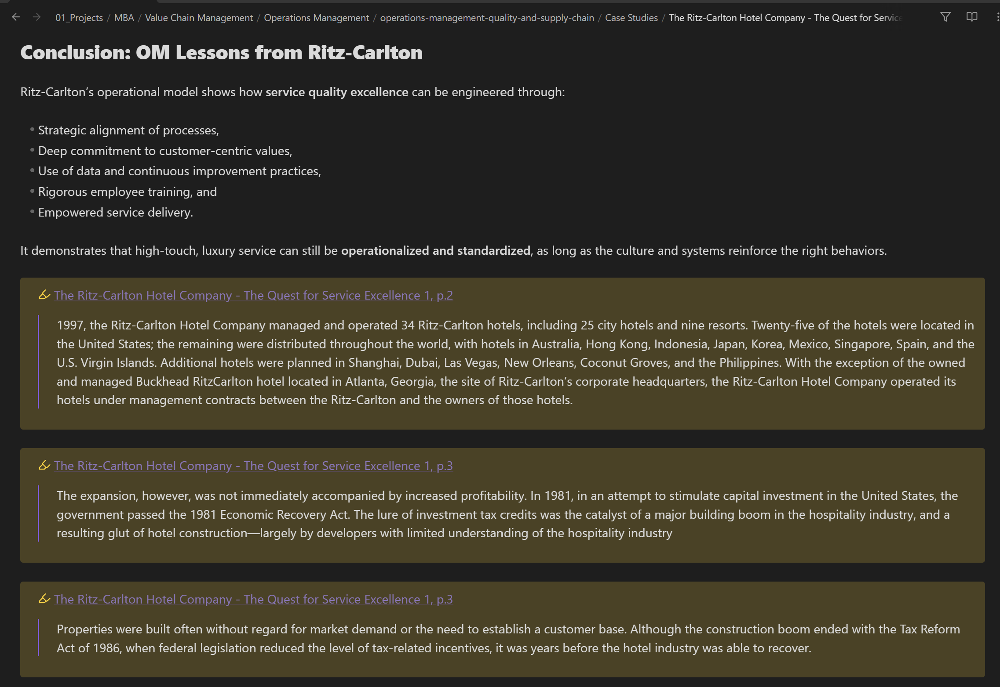

# Documentation

Welcome to the Notebook Automation documentation! This site provides comprehensive guides for using and contributing to the Notebook Automation toolkit.

## Quick Navigation

### For Users
- **[Getting Started](getting-started/index.md)** - Installation and setup
- **[User Guide](user-guide/index.md)** - File processing and workflows
- **[Configuration](configuration/index.md)** - Settings and customization
- **[Tutorials](tutorials/index.md)** - Step-by-step examples
- **[Troubleshooting](troubleshooting/index.md)** - Common issues and solutions

### For Developers
- **[Developer Guide](developer-guide/building.md)** - Development setup and contributing
- **[API Reference](api/index.html)** - Complete API documentation

## What is Notebook Automation?

Notebook Automation is a powerful C# toolkit that transforms educational content from various sources (PDFs, videos, OneDrive) into structured, AI-enhanced Obsidian notes. It's designed for students, educators, and knowledge workers who want to streamline their note-taking workflow.

## Key Features

- **Multi-format processing** - PDFs, videos, and OneDrive content
- **AI-powered enhancement** - Smart summarization and metadata extraction
- **Obsidian integration** - Generate properly formatted notes with frontmatter
- **Batch processing** - Handle multiple documents efficiently
- **Flexible configuration** - JSON-based settings with environment variable support

## Getting Help

- Check the [Troubleshooting Guide](troubleshooting/index.md) for common issues
- Visit our [GitHub Issues](https://github.com/danielshue/notebook-automation/issues) for bug reports
- Join the discussion at [GitHub Discussions](https://github.com/danielshue/notebook-automation/discussions)

### For Developers

- **[Developer Guide](developer-guide/)** - Building from source and contributing
- **[API Reference](api/)** - Complete API documentation
- **[Troubleshooting](troubleshooting/)** - Common issues and solutions

## 🌟 What is Notebook Automation?

Notebook Automation transforms the way you manage course materials, whether for MBA programs, online courses, or any structured educational content. It automates the tedious tasks of organizing files, extracting metadata, generating summaries, and maintaining consistency across your knowledge base.

### Key Capabilities

- **🤖 Intelligent Content Processing** - Automatically converts PDFs, videos, HTML, and other formats to structured Markdown notes
- **📊 Metadata Extraction** - Smart detection of course hierarchy, programs, modules, and lessons
- **🏷️ Advanced Tag Management ** - Hierarchical tag generation and consolidation for enhanced content discovery
- **☁️ OneDrive Integration** - Seamless file access, sharing, and synchronization via Microsoft Graph API
- **🧠 AI-Powered Summaries** - OpenAI and Azure AI integration for generating content summaries and insights
- **❓ AI Question Generation** - Automatically creates questions and answers for spaced repetition systems
- **📚 Index Generation** - Automated creation of navigation structures and dashboards
- **🔄 Cross-Platform Support** - Modern C# CLI application with .NET 9.0 runtime

## 📸 Screenshots & Features

### AI-Generated Page Summaries

Each processed document receives an intelligent summary that captures key points, main themes, and actionable insights. These summaries help you quickly review and recall important content.

### AI-Powered Question Generation

The system automatically generates intelligent questions and answers from your course content, perfect for creating study materials and spaced repetition systems. This feature leverages AI to identify key concepts and create meaningful assessment questions.

### Anki Integration for Spaced Repetition

These Questions and Answers can be used to seamlessly export the generated questions to Anki for optimized learning through spaced repetition. The tool creates properly formatted flashcards that integrate with your existing study workflow.

### Obsidian Class Overview with Hierarchical Structure

View your course content in a beautifully organized hierarchical structure within Obsidian. The base template system provides a clear overview of programs, modules, and lessons for easy navigation.

### Case Study Analysis Views

Detailed case study notes with structured analysis, key insights, and cross-references. The system automatically formats complex business cases into digestible, searchable content.

### PDF Annotation Processing

Automatically extract and process annotations from PDF documents, preserving highlights, comments, and notes in your knowledge base while maintaining proper attribution and context.

### Rich YAML Frontmatter

Comprehensive metadata extraction creates rich YAML frontmatter with course information, tags, relationships, and custom properties that enhance searchability and organization.

### Vocabulary and Definition Management

Automatically identify and extract key terms and definitions from course materials, creating a searchable vocabulary database with contextual usage examples that can also imported into Anki.

## 🏗️ Architecture

The project uses a **hybrid storage approach** that separates content types for optimal performance:

- **Obsidian Vault** - Lightweight Markdown files with metadata and references
- **OneDrive** - Large media files (videos, PDFs, audio) with automatic linking

This ensures your knowledge base remains fast and navigable while keeping all related media easily accessible.

## 📖 Documentation Sections

| Section | Description |
|---------|-------------|
| [Getting Started](getting-started/) | Installation, initial setup, and first steps |
| [User Guide](user-guide/) | Complete usage documentation and examples |
| [Configuration](configuration/) | System configuration, AI services, and integrations |
| [Developer Guide](developer-guide/) | Building from source, contributing, and architecture |
| [API Reference](api/) | Complete C# API documentation |
| [Troubleshooting](troubleshooting/) | Common issues, solutions, and debugging |

## 🤝 Community

- **[GitHub Repository](https://github.com/danielshue/notebook-automation)** - Source code and issue tracking
- **[GitHub Discussions](https://github.com/danielshue/notebook-automation/discussions)** - Community support and feature discussions
- **[GitHub Issues](https://github.com/danielshue/notebook-automation/issues)** - Bug reports and feature requests

---

*Made with ❤️ for the education and knowledge management community*
